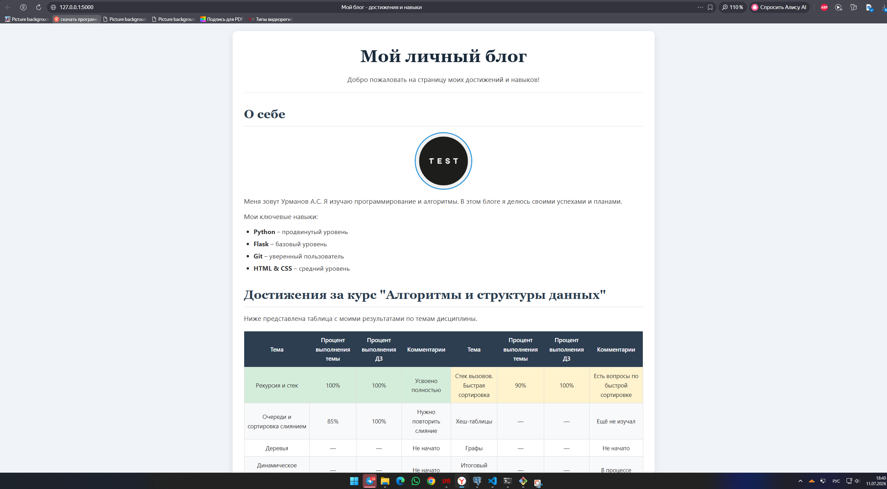

# Блог о достижениях и навыках

---

## 📸 Скриншоты

### Главная страница (ДЗ №12)


### Дневник программиста (ДЗ №13 – новое)


---

## 📋 Описание проекта

Это учебное веб-приложение представляет собой **персональный блог**, созданный с использованием микрофреймворка **Flask**.

**Что включает проект:**
- Главная страница с информацией о достижениях и таблицей прогресса по курсу
- Страница **«Дневник программиста»** с формой для добавления заметок
- Наследование шаблонов через Jinja2
- Полная стилизация с помощью CSS

Проект выполнен в рамках домашних заданий №12–13 по дисциплине **«Алгоритмы и структуры данных»**.

---

## ✨ Что было улучшено (ДЗ №13)

| Что добавлено | Описание |
|---------------|----------|
| **Новый маршрут** | Добавлена страница `/notes` – «Дневник программиста» |
| **Форма добавления записей** | Поля: заголовок + текст, кнопка отправки |
| **Хранение записей** | Данные сохраняются в словаре Python (в памяти) |
| **Наследование шаблонов** | `index.html` стал базовым, `notes.html` наследует его |
| **Навигация** | Ссылки «Главная» и «Дневник программиста» в шапке сайта |
| **Обновлённые стили** | Добавлены стили для формы, кнопки, списка записей |
| **Таблица** | Добавлена запись о третьей теме (ДП и итоговый проект) |

---

## 🛠️ Стек технологий

- **Python 3.6+** – язык программирования
- **Flask 2.3.2** – микрофреймворк для веб-разработки
- **HTML5** – семантическая разметка (10+ тегов)
- **CSS3** – каскадные таблицы стилей
- **Jinja2** – шаблонизатор (наследование, циклы, условия)

---

## 📁 Структура проекта
flask_blog_hw/
│
├── app.py # Flask-приложение (маршруты / и /notes)
├── requirements.txt # Зависимости (Flask)
├── templates/ # HTML-шаблоны
│ ├── index.html # Базовый шаблон (главная + навигация)
│ └── notes.html # Наследуемый шаблон (дневник)
├── static/ # Статика (CSS, изображения)
│ ├── style.css # Стилизация (фон, шрифты, форма, таблица)
│ └── images/
│ └── avatar.png # Аватар
├── screenshot.png # Скриншот главной страницы
├── screenshot_notes.png # Скриншот страницы дневника
├── README.md # Этот файл
└── .gitignore # Игнорирование временных файлов

text

---

## 🚀 Как запустить проект

### 1. Клонируйте репозиторий
```bash
git clone https://github.com/artemurmanov45-hash/flask_blog_hw.git
cd flask_blog_hw
2. Установите зависимости
bash
pip install -r requirements.txt
3. Запустите приложение
bash
python app.py
4. Откройте в браузере
Перейдите по адресу:
👉 http://127.0.0.1:5000

🎨 Что реализовано
Главная страница
Приветственный заголовок (h1) и подзаголовок (h2)

Текст-описание с перечислением навыков (p, ul, li)

Изображение (аватар) с корректным размером и обрезкой по кругу

Разделы: «О себе» и «Достижения за курс»

Таблица 8×4 (8 колонок, 4 строки данных) с прогрессом по темам

Футер с копирайтом и ссылкой «Наверх»

Дневник программиста (страница /notes)
Форма для добавления записи (заголовок + текст)

Кнопка отправки

Отображение всех добавленных записей

Хранение записей в словаре (в памяти сервера)

CSS-стилизация (полная)
Фон – светло-голубой (#f0f4f8)

Шрифты – заголовки (Georgia), основной текст (Segoe UI)

Размеры – заголовки крупные, текст увеличен до 1.1rem

Изображение – размер 150×150, обрезка по кругу

Расположение – все элементы центрированы, отступы

Форма – стилизована, кнопка с эффектом при наведении

Записи – оформлены в виде карточек с левой рамкой

📊 Критерии оценки
Критерий	Баллы	Статус
К1 – Создан новый проект с правильной структурой и Python кодом для запуска шаблона	1	✅
К2 – Создан HTML шаблон, состоящий минимум из 10 тегов	3	✅
К3 – Страница стилизована на 100% (фон, шрифты, размеры, изображение, расположение)	3	✅
К4 – Корректно создана таблица из 8 колонок и 4 строк	2	✅
К5 – Таблица заполнена по условию (все темы, проценты, комментарии)	2	✅
Итого	11/11	✅
🎯 Критерии ДЗ №13
Критерий	Баллы	Статус
К1 – Маршрут на новый шаблон и базовый шаблон	1	✅
К2 – Кнопка перехода на другую страницу и обратно	2	✅
К3 – Данные с формы сохраняются в словарь и отображаются	2	✅
К4 – Сайт стилизован CSS	2	✅
К5 – В таблице присутствует запись о третьей теме	2	✅
Итого	9/9	✅
📸 Скриншоты
Ниже представлены скриншоты работающего приложения:

Главная страница
https://screenshot.png

Дневник программиста (форма и записи)
https://screenshot_notes.png

👨‍💻 Автор
Урманов А. С.
GitHub: artemurmanov45-hash
Группа: [номер группы]
Дата: Июль 2026

📄 Лицензия
Проект выполнен в учебных целях и не предназначен для коммерческого использования.

text

---

## ✅ ЧТО БЫЛО УЛУЧШЕНО

| Что добавлено | Описание |
|---------------|----------|
| **Раздел «Что было улучшено»** | Чёткий список новшеств ДЗ №13 |
| **Порядок скриншотов** | Сначала главная (основа), потом дневник (новое) |
| **Две таблицы критериев** | Для ДЗ №12 и ДЗ №13 – отдельно |
| **Чёткая структура** | Разделы выделены, всё логично |
| **Описание нового функционала** | Форма, записи, наследование, навигация |

---

## 🚀 КАК ОБНОВИТЬ README НА GITHUB

```bash
# 1. Сохрани изменения в README.md
# 2. Добавь файл в Git
git add README.md

# 3. Сделай коммит
git commit -m "Обновлён README: добавлен раздел о новом функционале ДЗ №13"

# 4. Отправь на GitHub
git push
