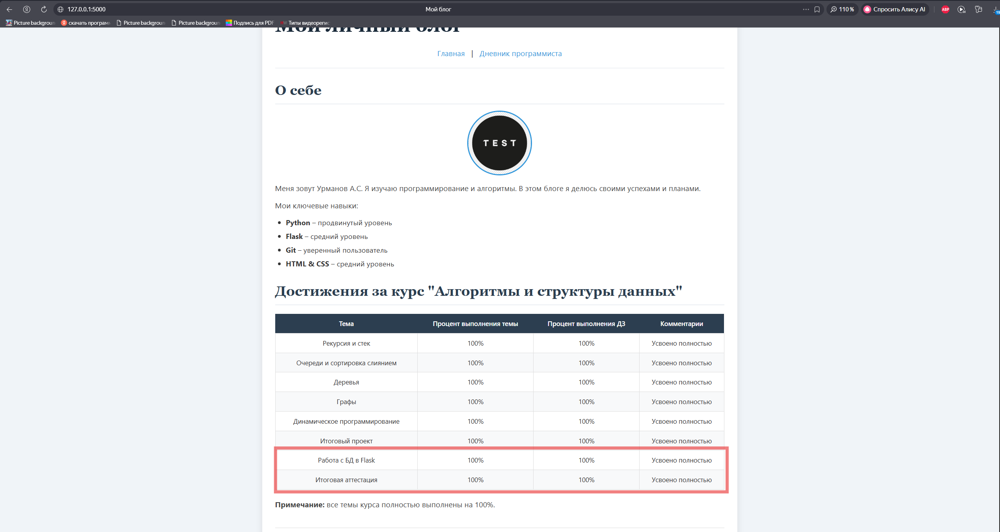
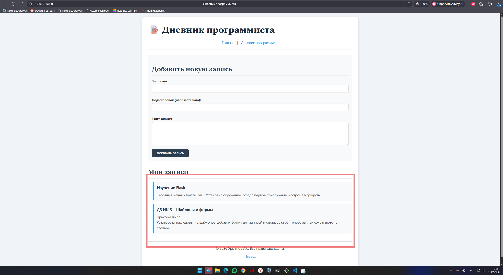
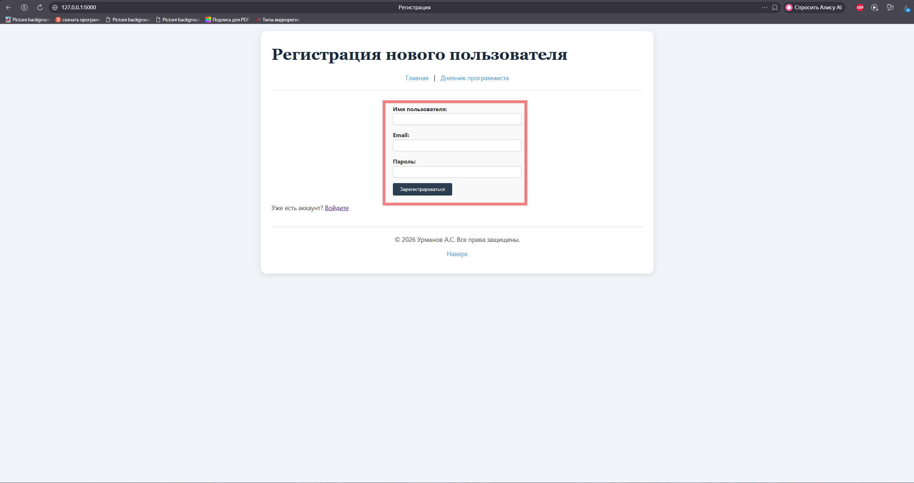
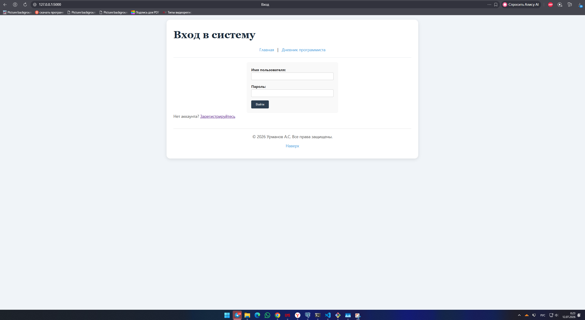
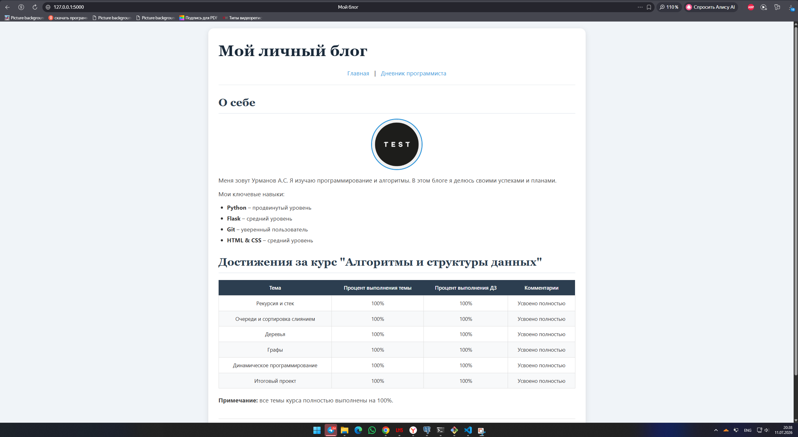

# Блог о достижениях и навыках

---

## 📸 Скриншоты (уменьшенные)

### Главная страница (с таблицей и новой темой)
<p align="center">
  
  <br>
  <em>Главная страница (с таблицей и новой темой)</em>
</p>

### Дневник программиста (форма и записи с подзаголовками)
<p align="center">
  
  <br>
  <em>Дневник программиста (форма и записи с подзаголовками)</em>
</p>

### Страница `/home` (главная с кнопками)
<p align="center">
  
  <br>
  <em>Страница /home – вход/регистрация</em>
</p>

### Страница регистрации `/register`
<p align="center">
  
  <br>
  <em>Форма регистрации</em>
</p>

### Страница входа `/login`
<p align="center">
  
  <br>
  <em>Форма входа</em>
</p>

### Дневник после авторизации
<p align="center">
  
  <br>
  <em>Дневник программиста (доступ после входа)</em>
</p>

---

## 📋 Описание проекта

Это учебное веб-приложение представляет собой **персональный блог**, созданный с использованием микрофреймворка **Flask**.

**Что включает проект:**
- Главная страница с информацией о достижениях и таблицей прогресса по курсу
- Страница **«Дневник программиста»** с формой для добавления заметок
- Наследование шаблонов через Jinja2
- Полная стилизация с помощью CSS
- **База данных SQLite** для хранения записей дневника
- **Авторизация пользователей** (регистрация, вход, выход)
- **Генерация и проверка токенов** для защиты страниц

Проект выполнен в рамках домашних заданий №12–15 по дисциплине **«Алгоритмы и структуры данных»**.

---

## ✨ Что было улучшено (ДЗ Тема №4)

| Что добавлено | Описание |
|---------------|----------|
| **База данных SQLite** | Подключена через SQLAlchemy |
| **Модель Notes** | Создана модель с полями: `title`, `subtitle`, `text` |
| **Форма с подзаголовком** | Добавлено поле `subtitle` в форму добавления записи |
| **Сохранение в БД** | Записи теперь хранятся в базе данных, а не в памяти |
| **Миграции** | Созданы и применены миграции для добавления колонки `subtitle` |
| **Новая тема в таблице** | В таблицу на главной добавлена строка «Работа с БД в Flask» и «Итоговая аттестация» |
| **Обновлённые скриншоты** | Отображены новые версии главной страницы и дневника |

---

## ✨ Что было добавлено (ДЗ Тема №5 – авторизация)

| Что добавлено | Описание |
|---------------|----------|
| **Модель Users** | Создана модель для хранения пользователей (username, email, password, token, token_expiry) |
| **Страница /home** | Главная страница с кнопками «Регистрация» и «Вход» |
| **Страница /register** | Форма для регистрации нового пользователя (username, email, password) |
| **Страница /login** | Форма для входа с проверкой логина и пароля |
| **Хэширование паролей** | Используется `bcrypt` для безопасного хранения паролей |
| **Генерация токенов** | Для каждого пользователя генерируется JWT-токен при входе |
| **Проверка токенов** | Страница `/notes` защищена – доступ только при действительном токене |
| **Выход (/logout)** | Очистка сессии и перенаправление на /home |

---

## 🛠️ Стек технологий

- **Python 3.6+** – язык программирования
- **Flask 2.3.2** – микрофреймворк для веб-разработки
- **Flask-SQLAlchemy** – ORM для работы с БД
- **Flask-Migrate** – управление миграциями
- **SQLite** – база данных (лёгкая, файловая)
- **bcrypt** – хэширование паролей
- **PyJWT** – генерация и проверка JSON Web Tokens
- **HTML5, CSS3, Jinja2** – фронтенд

---

## 📁 Структура проекта
flask_blog_hw/
│
├── app.py # Flask-приложение (модели, маршруты, авторизация)
├── requirements.txt # Зависимости (Flask, SQLAlchemy, Migrate, bcrypt, pyjwt)
├── templates/
│ ├── index.html # Базовый шаблон
│ ├── home.html # Главная страница с кнопками (НОВОЕ)
│ ├── register.html # Форма регистрации (НОВОЕ)
│ ├── login.html # Форма входа (НОВОЕ)
│ └── notes.html # Дневник программиста
├── static/
│ ├── style.css # Стилизация
│ └── images/
│ └── avatar.png # Аватар
├── migrations/ # Миграции (история изменений БД)
├── instance/ # Папка с БД (игнорируется)
├── screenshot_v2.png # Скриншот главной страницы (старый)
├── screenshot_notes_v2.png # Скриншот дневника (старый)
├── screenshot_home.png # Скриншот страницы /home (НОВЫЙ)
├── screenshot_register.png # Скриншот регистрации (НОВЫЙ)
├── screenshot_login.png # Скриншот входа (НОВЫЙ)
├── screenshot_notes.png # Скриншот дневника (после авторизации) (НОВЫЙ)
├── README.md # Этот файл
└── .gitignore # Игнорирование временных файлов и БД

text

---

## 🚀 Как запустить проект

### 1. Клонируйте репозиторий
```bash
git clone https://github.com/artemurmanov45-hash/flask_blog_hw.git
cd flask_blog_hw
2. Установите зависимости
bash
pip install -r requirements.txt
3. Примените миграции (создайте БД)
bash
python -m flask db upgrade
4. Запустите приложение
bash
python app.py
5. Откройте в браузере
Перейдите по адресу:
👉 http://127.0.0.1:5000

🎨 Что реализовано
Главная страница
Приветственный заголовок (h1) и подзаголовок (h2)

Текст-описание с перечислением навыков (p, ul, li)

Изображение (аватар) с корректным размером и обрезкой по кругу

Разделы: «О себе» и «Достижения за курс»

Таблица с прогрессом по темам (все темы курса, включая новые)

Футер с копирайтом и ссылкой «Наверх»

Дневник программиста (страница /notes)
Доступ только для авторизованных пользователей

Форма для добавления записи (заголовок, подзаголовок, текст)

Кнопка отправки

Отображение всех добавленных записей из базы данных

Хранение записей в SQLite (сохраняются после перезапуска)

Авторизация
Страница /home – выбор: войти или зарегистрироваться

Регистрация – создание нового пользователя с хэшированием пароля

Вход – проверка логина и пароля, генерация токена

Защита страниц – проверка токена для доступа к /notes

Выход – очистка сессии

CSS-стилизация (полная)
Фон – светло-голубой

Шрифты – заголовки (Georgia), основной текст (Segoe UI)

Размеры – заголовки крупные, текст увеличен

Изображение – размер 150×150, обрезка по кругу

Расположение – все элементы центрированы, отступы

Форма – стилизована, кнопка с эффектом при наведении

Записи – оформлены в виде карточек с левой рамкой

📊 Критерии оценки ДЗ №12–13
Критерий	Баллы	Статус
К1 – Структура и Python код	1	✅
К2 – HTML (10+ тегов)	3	✅
К3 – CSS стилизация (полная)	3	✅
К4 – Таблица 8×4	2	✅
К5 – Заполнение таблицы	2	✅
ДЗ №13 – шаблоны и формы	9	✅
Итого	20/20	✅
📊 Критерии оценки ДЗ №14
Критерий	Баллы	Статус
К1 – Модель Notes создана	1	✅
К2 – Обработка и выгрузка данных	2	✅
К3 – Миграция выполнена	2	✅
К4 – Новая тема в таблице	2	✅
Итого	7/7	✅
📊 Критерии оценки ДЗ №15 (авторизация)
Критерий	Баллы	Статус
К2 – Создан шаблон home.html	1	✅
К3 – Регистрация работает (добавление в БД)	2	✅
К4 – Логин работает (проверка, редирект)	2	✅
К5 – Генерация токена	1	✅
К6 – Проверка токена	1	✅
Итого	7/7	✅
📸 Скриншоты (уменьшенные)
Главная страница (с таблицей и новой темой)
<p align="center">  </p>
Дневник программиста (с формой и записями)
<p align="center">  </p>
Страница /home (главная с кнопками)
<p align="center">  </p>
Страница регистрации /register
<p align="center">  </p>
Страница входа /login
<p align="center">  </p>
Дневник после авторизации
<p align="center">  </p>
👨‍💻 Автор
Урманов А. С.
GitHub: artemurmanov45-hash
Группа: [номер группы]
Дата: Июль 2026

📄 Лицензия
Проект выполнен в учебных целях и не предназначен для коммерческого использования.

text

---

## ✅ ЧТО ДАЛЬШЕ

1. **Сохрани этот код в файл `README.md`**.
2. **Добавь его в Git и отправь на GitHub:**

```bash
git add README.md
git commit -m "Обновлён README: добавлены скриншоты и описание авторизации (ДЗ №15)"
git push
